# Gradle下载及配置
## 下载 Gradle
下载网址：https://gradle.org/releases/


## 解压
记住解压的路径（例D:\Gradle\gradle-6.6.1）

## 配置环境变量
1）新增系统变量：GRADLE_HOME 变量值：
   D:\Gradle\gradle-6.6.1（解压路径）

2）新增PATH环境变量：%GRADLE_HOME%\bin

## 检验是否配置完成
cmd中输入gradle -v 若显示版本号则配置完成。

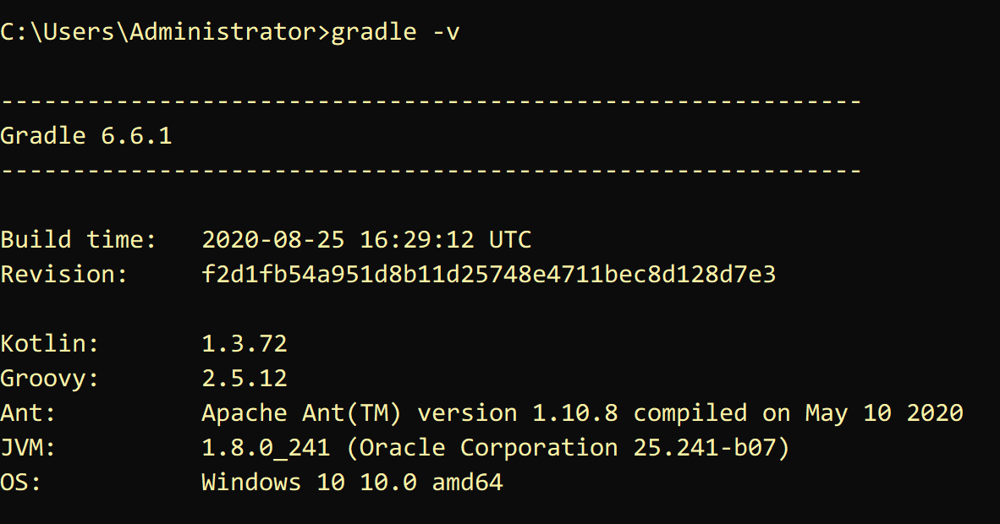

# Groovy的基本语法
1）Groovy类和Java是二进制兼容的，Groovy编译器产生的字节码与Java编译器产生的字节码是完全一样的。

2）**对于JVM而言，Groovy和Java是完全一样的**，因此，Groovy能够完全使用各种Java API。

3）Groovy也是一门面向对象的语言。也就是说，Groovy中每一个事物最终都会被当做某些类的一个实例对象。

**4）groovy支持函数式编程，不需要main函数。**

5）groovy支持单元测试和模拟（对象），可以简化测试。

6）groovy中默认都是public（类、成员属性、方法等），groovy接口中不允许定义非public的方法。

7）groovy类会默认会成员变量生成getter与setter方法。无论你是直接使用还是调用get/set，最终都是调用     get/set方法，如：person.name相当于person.getName()

**8）在Groovy可以用def定义无类型的变量和返回值为无类型的方法。**

**部分语法代码演示:**

```Groovy
// 1.句尾分号可以省略
// 2.括号可以省略
// 3.定义变量用 def 例如
def i=10

// 4.定义集合，由于{ }是给闭包使用，所以定义集合或数据要用[ ]
def list=[‘a’,’b’]
list  << ‘c’
println list.get(2);

// 5.定义一个map
def map=['key1':'value1','key2':value2]
map.key3='value3'
println map.get(“key3”)

// 6.Groovy中的闭包

// 闭包其实是一段代码块，我们主要把闭包当作参数来使用
 def b1={
　　println “hello b1”
}

// 定义一个方法，方法里面需要闭包类型的参数
 def method1(Closure closure){
　　closure()
}
method1(b1)

// 7.定义一个闭包带参数
def b2={
　　V ->
　　println “hello ${v}”
}

 def method2(Closure closure){
　　closure(“b2”)
}
method2(b2)
```


# 命令行下gradle的使用
## project的创建
**mkdir filename**创建项目所在文件夹

**gradle init**创建项目


其中project type有四种类型分别是：

1、基础类型
2、应用类型
3、库类型
4、gradle插件

build script DSL（构建脚本语言）：

1、groovy
2、kotlin

## 创建的project里各文件的作用


**gradle** 包含gradle wapper的可执行库以及一些配置属性

**gradlew、gradlew.bat**分别是基于UNIX与WINDOWS的gradle wapper脚本

**build.gradle**项目配置脚本，用于配置当前项目中的任务

**setting.gradle**用于配置哪些项目参与构建的配置脚本

## task的创建以及基本操作
### task的创建（在build.gradle里创建）
task taskname(type, group, description,depensOn) {}

**type**:表示任务的种类，比如copy、zip等（必要）

**group**：表示任务所属的组（非必要）

**description**：表示对任务的描述（非必要）

**depensOn**：表示任务之间的依赖关系（非必要）
```java
task compile {
    doLast {
        println 'hello compile'
    }
}


task compile2 {
    doLast {
        println 'hello compiling2'
    }
}

task compileTest(dependsOn:compile) {
    doLast {
        println 'hello compileTest'
    }
}
```
**dependsOn:compile** 表示compileTest依赖于compile即在运行compileTest时会先执行compile在执行compileTest

### task的运行以及查看
**gradle taskname1 taskname2** 按照先后运行名为taskname1、taskname2的任务


有依赖关系时：

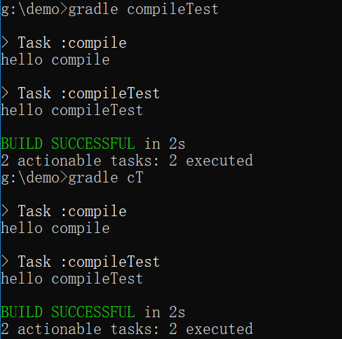

**gradle tasks --all** 查看所有任务

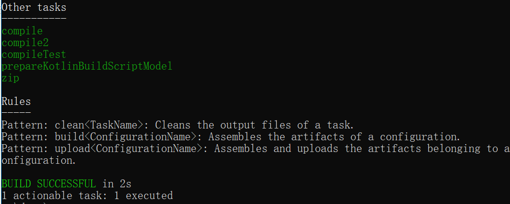

**gradle help --task taskname**查看taskname的详细信息

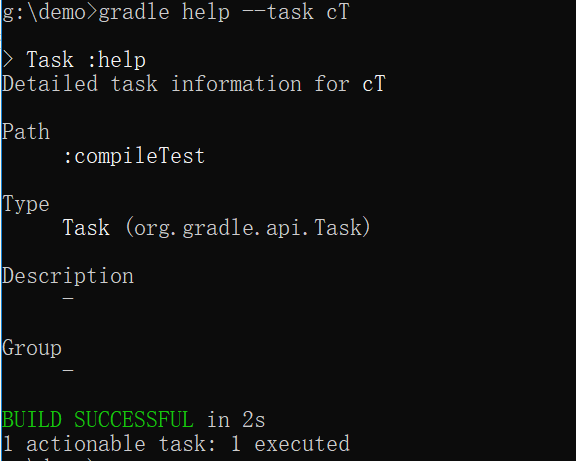

其中的type、description、group都是创建任务时就已经确定，path是关于build.gradle文件内的任务名

**gradle taskname1 -x taskname2** 运行taskname1但不运行taskname1里的taskname2任务，主要用来避免依赖关系的运行


**-m标签** 使用此标签可以查看任务的执行顺序，并不会真的执行（适合多依赖关系）


**-q标签** 简化输出内容，用来屏蔽其他辅助型的输出，只输出task的输出以及错误流

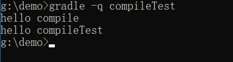

## 插件的使用
插件的使用需要在build.gradle文件里导入插件

```java
plugins{
    id "插件名"//比如 java,web,base等等
}
```

比如我需要对某个文件进行打包那么代码如下：

```java
plugins {
    id "base"
}

task zip(type: Zip) {
	from "gradle"
	archiveFileName = "demo1.zip"
}
```


这里表示使用插件base将文件名为gradle的文件打包到名为demo1.zip的文件里。这些打包好的文件会统一放在项目里的新建build/distributions文件夹里（运行任务后自动创建）


**注意这里需要表明task的类型type，若未注明则在任务执行时会报错**

```java
plugins {
    id "base"
}

task zip {
	from "gradle"
	archiveFileName = "demo1.zip"
}
```

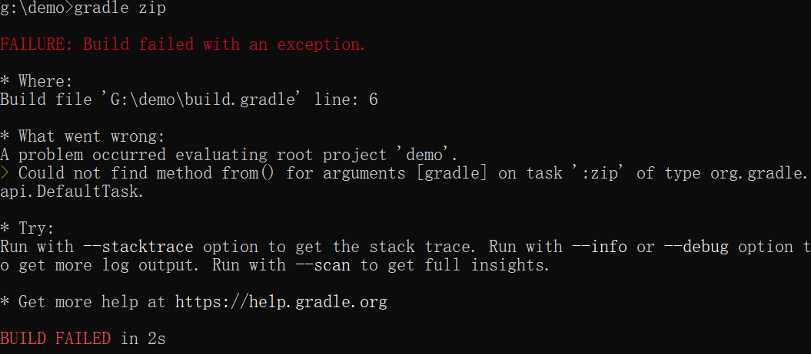


## 项目属性的查看
**gradle properties** 查看项目的所有属性

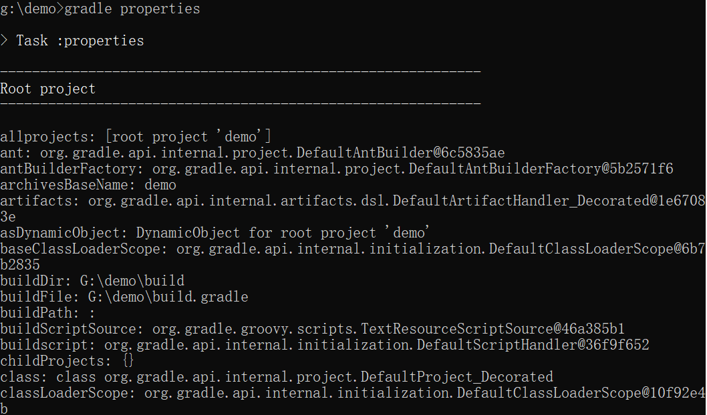

如果需要标注版本号，只需在build.gradle里插入：
```java
version 1.0//版本号
```
之后再次查看项目属性时便可以看到版本信息

## 项目日志查看
**gradle --profile**

运行后在build/reports/profile(自动生成)会生成一个html文件打开便可以查看项目日志

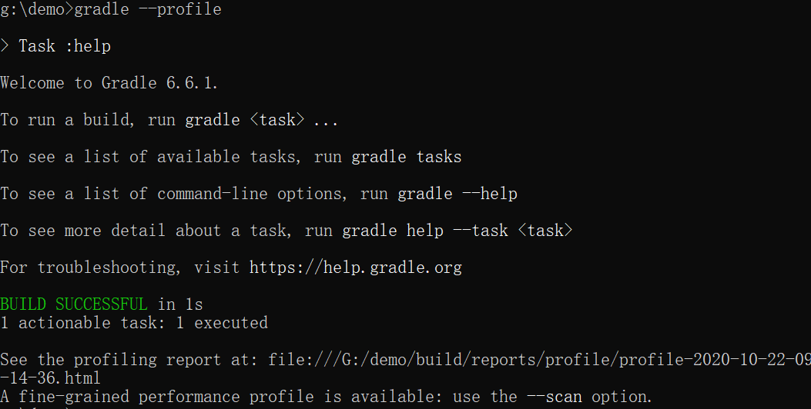

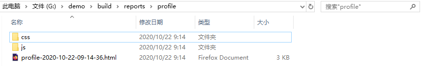

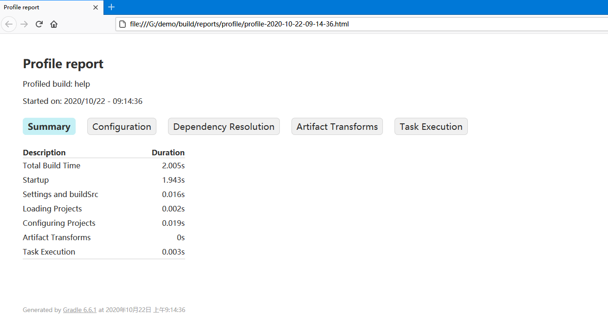

## 项目分享

**gradle build --scan** 使用后会生成链接


**输入yes获取链接**


浏览器打开链接输入邮箱激活后便可进行分享

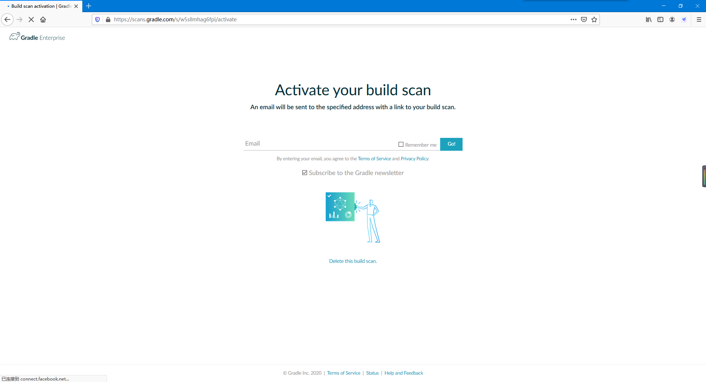


# 使用 IDEA 创建一个基于 Gradle 的项目
## 打开 IDEA

## 选择 Create New Project
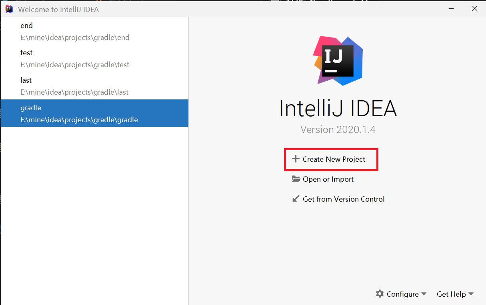
## 选择项目类型

## 填写项目坐标

## 等待，出现 BUILD SUCCESSFUL... 说明创建成功


# 查看项目配置
**进入 File -> Setting，或快捷键 Ctrl + Alt + S 。**


**左上角搜索框键入 ‘gradle’，你会看到项目的配置信息，大致是这样的**


## Gradle use home
*-- Gradle 把下载的东西（依赖、插件、Gradle 包装器等）放在这里！ --*

**如果**设置了 ‘GRADLE_USER_HOME’ 环境变量，IDEA 会根据环境变量进行推导，并推荐一个路径作为默认路径。

**如果** IDEA 没有推导出，
会以 ‘C:\Users\Administrator\.gradle’ 作为默认值
*(Windows)*。

*-- 可以手动指定任意路径。手动指定优于环境变量。 --*

**看一下 Gradle use home:**

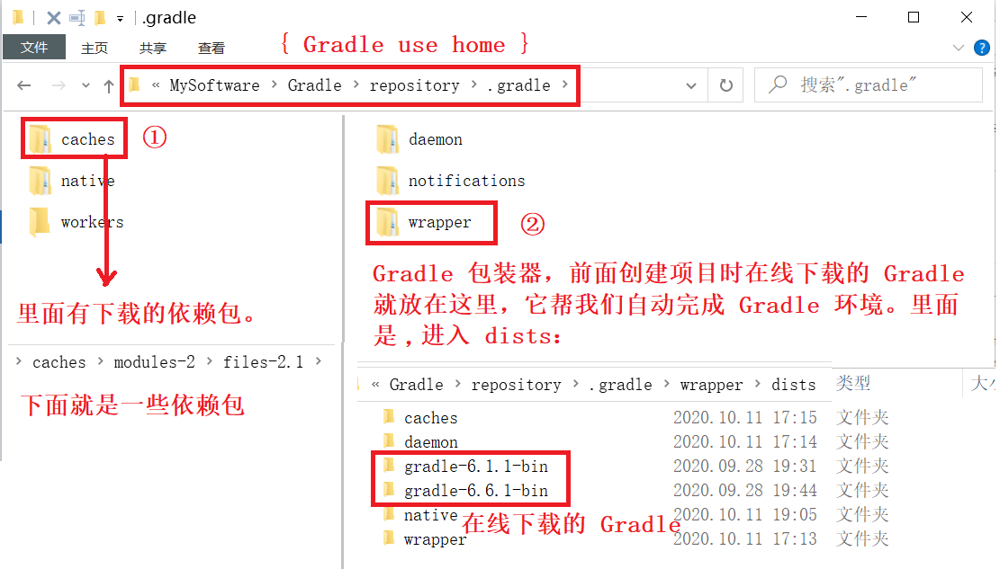

## Use gradle from
**a** . specified location ：使用之前下载到本地的 gradle 进行项目构建。

**b**. wrapper task in build.gradle : 通过执行构建脚本中自定义的 wrapper 任务下载gradle。

**c** . gradle-wrapper.properties : 使用配置文件提供的 url 下载gradle包装器。

**推荐 c ，可以将Gradle版本的更新委派给Gradle并自动下载该版本的Gradle 。**

# 查看项目目录结构
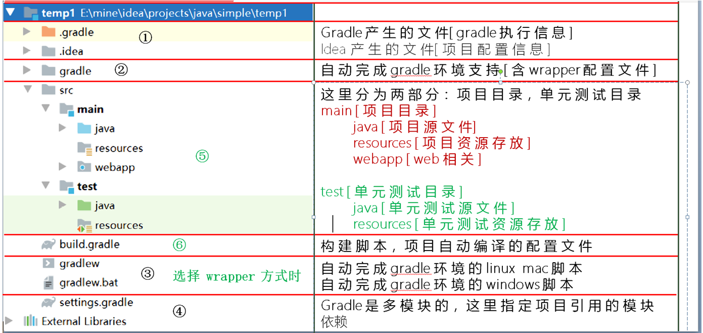

③
gradlew，gradlew.bat会：
解析wrapper文件，拿到gradle下载地址，首先判断本地是否存在该版本gradle，有则直接
利用 ./gradle 目录下对应的版本的 gradle 进行相应自动编译操作。
没有，根据地址下载到本地，在根据./gradle目录下对应版本的gradle进行相应的自动编译操作。

⑤ Java 插件引入了源集（Source sets）的概念，源集可以简单理解为“一组源文件的集合”，在逻辑上对源文件进行分组。
java插件提供了两个标准源集：main 和 test。这是 java 插件引入的两个约定，就不需要手动创建源文件目录和资源文件目录了。

⑥ build.gradle 构建脚本
Gradle 的自动化构建项目就是通过执行 build.gradle 构建脚本实现的。
而构建脚本中引入了项目需要用到的 gradle 插件。
Gradle可以认为是一个框架，负责定义流程和规则。而大多数的功能都是通过插件的方式来完成的。

# 认识 Gradle 构建脚本
group、version、plugin、repositories、dependencies 都是 Gradle 预定义好的方法，Gradle 在构建项目时会自动执行这些方法，我们只需要向里面传入参数，而大多数参数都是闭包。
## group 、version
```Groovy
group 'cn.jt' // 等价于：setGroup('cn.jt')
version '1.0-SNAPSHOT' // 等价于：setVersion('1.0-SNAPSHOT')
```

## plugin
```groovy
plugins {
    id 'java'
    id 'war'
//  id '插件名' <-- 引入插件
}
```
插件。plugin 方法的参数就是一个闭包：


我们也可以在 build.gradle 中自定义插件,刷新：
```Groovy
// 自定义插件
class MyPlugin implements Plugin<Project> {
    @Override
    void apply(Project project) {
        //新建task hello
        project.task('hello') {
            doLast {
                println 'Hello MyPlugin!'
            }
        }
    }
}
// 引入插件，观察 other 中任务变化
apply plugin: MyPlugin
```
右侧 other 中多了一个我们刚才自定义的 ‘hello’ 任务：

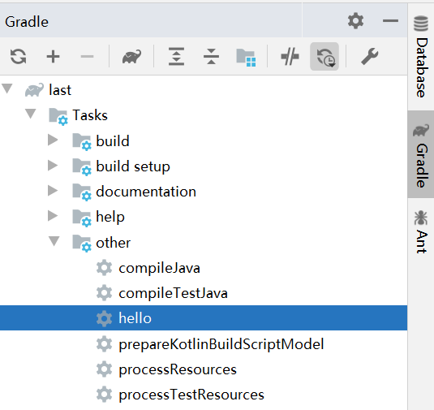

我们双击运行：


***当然你也可以自定义功能更加复杂的插件。***

## repositories
```groovy
repositories {
    mavenCentral()
}
```
仓库。这里调用了 mavenCentral() 的方法表示先从本地的 gradle 仓库中寻找依赖包，找到了直接导入，没找到再到 maven 中央仓库寻找。
也可以设置从阿里云下载。
```groovy
repositories {
 	// mavenCentral()
    maven {
        url 'http://maven.aliyun.com/nexus/content/groups/public/'
    }
}
```
这和上面是一样的，只是换了一个 url 。

## dependencies
依赖。


# 依赖管理
## 依赖概述

​几乎所有的基于JVM的软件项目都需要依赖外部类库来重用现有的功能。自动化的依赖管理可以明确依赖的版本，可以解决因传递性依赖带来的版本冲突。

​依赖可以是一个 project(或者说一个module)、一个 jar 包，或者是依赖远程仓库。例：

```gradle
dependencies {

  //方式1： 依赖一个名字为 "common" 的 project
  compile project(":common")

  //方式2： 依赖一个本地 jar
  //依赖当前 module/libs/aliyun-vod-croe-android-sdk-1.0.0.jar
  compile files('libs/aliyun-vod-croe-android-sdk-1.0.0.jar')

  //方式2 扩展：通过 fileTree 指定 dir 依赖所有的 jar 包
  compile fileTree(dir: 'libs', include: ['*.jar'])

  //方式3： 依赖一个远程仓库的包
  compile 'com.android.support:appcompat-v7:26.1.0'
}
```

## 自动化的依赖管理

自动化依赖管理需要知道依赖的确切版本和管理传递性依赖（即解决版本冲突）。

在项目中，如果不清楚项目依赖的版本，那么项目的维护会变得很困难，因为如果没有去精心记录，根本无法确定项目所依赖的类库版本实际支持哪些特性。

传递性依赖在项目开发的早期阶段就需要注意。这些依赖类库是项目正常工作的保障，一个类库可能需要许多其他类库才能正常工作，这就会存在传递性依赖，（比如B依赖A，如果C依赖B，那么C依赖A）。


## 添加依赖

​一个依赖是通过group标识符、name和一个指定版本version来确定的，是可以唯一标识一个依赖，根据group、name、version可以在仓库中找到唯一的一个jar包。

我们可以到maven仓库 https://mvnrepository.com/ 去找我们要依赖的包，可以选择要依赖的版本以及该包在不同构建工具下的写法，复制到build.gradle中，可以看到引入依赖之后可以联想出一些里面的类。


## 版本冲突

这里我们引入的hibernate依赖是存在传递性依赖和版本冲突的，我们在旁边Gradle里项目->task->build->build，发现Gradle并没有报错，因为如果 Gradle 发现有版本冲突，Gradle会 默认选择当前该库的最新版本。

我们通过在Gradle的task->help->dependencies，可以比较清楚的看到版本间的关系。理解 Gradle 依赖关系树的格式：

•	+- - - 是依赖分支库的开始。

•	| 标识还是在之前的依赖库中的依赖，显示它依赖的库。

•	\- - - 是依赖库的末尾。

除了通过dependencies查看，我们还可以配置build.gradle，当 Gradle 构建遇到依赖冲突时，就立即构建失败,来提醒我们产生了版本冲突。

```gradle
configurations.all() {
    Configuration configuration ->
        //当遇到版本冲突时直接构建失败
        configuration.resolutionStrategy.failOnVersionConflict()
}
```

我们在旁边Gradle里项目->task->build->build，Gradle报错，解决版本冲突的方法有两种：

1）排除传递性依赖：排除一个依赖或是排除所有的传递性依赖（后者是少见的，我们不可能排除所有的传递性依赖）。使用ModuleDependency中的exclude方法来排除传递性依赖，注意排除属性与常用的依赖标记略有不同，这里的module相当于name，因为Gradle不允许只排除某个特定版本的依赖，所以version属性是不可用的。

```gradle
//    compile (group: 'org.hibernate', name: 'hibernate-core', version: '3.6.3.Final'){
//        exclude group:'org.slf4j',module:'slf4j-api'//对某一个库排除传递依赖
//        //transitive = false  //排除所有的传递性依赖
//    }
```

2）为发生冲突的依赖强制指定一个版本

```java
configurations.all() {

  Configuration configuration ->

    configuration.resolutionStrategy.force(['org.slf4j:slf4j-api:1.6.1'])

   //或者这样写

   //resolutionStrategy.setForcedModules(['org.slf4j:slf4j-api:1.6.1'])

}
```

到目前为止，我们只声明了对外部类库的某一个特定版本的依赖，我们还可以获取最新版本的依赖，也就是动态版本声明，它有一个特定的语法，如果你想使用最新版本的依赖，必须使用占位符latest.integration，例如'org.slf4j:slf4j-api:latest.integration'，这里用冒号：分隔的写法就相当于是 group:name:version，而version用占位符表示了。

但动态版本最好是少用或者不用，因为在项目中，可靠的可重复构建的才是最重要的，使用最新版本的类库可能会导致构建失败，更坏的情况可能是在不知情的情况下，引入了不兼容的类库版本和副作用，因此，我们应该习惯去声明类库的确切版本。

# 单元测试

测试代码在软件开发生命周期中是一件重要的事情。通过检查软件是否按预期运行来确保软件的质量。Gradle集成了许多Java和 Groovy 的单元测试框架。可以使用Junit、TestNG和Spock编写测试，Gradle允许在一个项目中使用不同的测试框架。如果要构建可靠的、高质量的软件，自动化测试是开发工具箱的关键组成部分。此外，它将有助于减少手工测试的成本，提高开发团队重构现有代码的能力，并帮助在开发生命周期中尽早地发现代码中的缺陷。

## 自动化测试

并不是所有的自动化测试都一样。它们通常在使用范围、实现难度和执行时间上存在不同。

自动化测试类型：单元测试、集成测试、功能测试。

我们可能会想哪种测试类型最适合项目以及如何扩展的问题。在最理想的情况下，我们可以混合使用这些测试来确保代码能够在不同的架构上正常工作。但是，所编写的测试数量是需要花费时间和精力来实现和维护的。所编写的测试越简单，执行就越快，就会得到更高的投资回报率（ROI）。

自动化测试金字塔------这是Mike Cohn在他的书Succeeding with Agile:Software Development Using Scrum(Addsion Wesley ,2009)中提出来的。

​


所以为了优化投资回报率，代码库应该包含大量的单元测试、少量集成测试以及更少的功能测试。

### 功能测试

​功能测试通常用于测试应用程序的端到端功能，包括从用户的角度与所有外部系统的交互。功能测试是最难实现的和运行最慢的，因为它们需要模拟用户交互。以Web应用程序为例，功能测试的工具需要能够点击链接，将数据输入表单字段中，或者在浏览器窗口中提交表单。因为用户界面会随着时间的推移发生改变，维护功能测试代码就会变得乏味而耗时。

### 集成测试

​集成测试用来测试一个完整的组件或子系统。确保多个类之间的交互是否按预期运行。集成测试的一个典型场景就是验证产品代码和数据库之间的交互。验证的结果是，依赖的子系统、资源以及服务在测试执行中都是可以访问的。集成测试通常比单元测试需要更长的执行时间，而且更加难以维护，失败的原因可能更难以诊断。

### 单元测试

​单元测试与产品代码实现一起作为一个task来执行，目的是测试代码的最小单元。在基于Java的项目中，这个单元是一个方法。在单元测试中，需要避免与其他类或外部系统交互（例如，数据库或文件系统)。在被测试代码中对其他组件的引用，通常用测试替身独立出来，这是测试中替代组件的一个通用术语，如Stub（打桩）或Mock（模拟)。单元测试很容易编写，可以快速执行，并在开发过程中针对代码的正确性提供宝贵的反馈。

​idea可以为我们选择的方法自动生成xxxTest.java文件，Junit提供了一些辅助函数用来帮助我们来判断被测试的方法是否如我们预期的效果一样正常执行。断言就是专门用来验证输出和期望是否一致的一个工具，它是通过比较一个实际值actual和一个期望值expected来实现的。当我们对类，模块或者方法的输入和输出有着很明确的定义和认识，当程序的输出结果和输入不匹配时，我们想让程序有一个明确的返回。比如：我明确地知道1+1=2,我现在就想知道我输入1+1会不会得到2，如果不是程序返回一个错误。

```java
`assertEquals(expected:3,actual:4,delta:1);//delta 这个参数为误差参数，表示如果 expected 和 actual 之间的差值在 delta 范围之内则认为该断言的结果是正确的
```

​我们在旁边Gradle里项目->task->verification->test，我们可以查看Gradle生成的HTML报告（build/reports/test），报告总结了运行测试的数量，失败率和执行时间，可以通过点击切换包和类的视图，如果有一个测试失败，可以查看失败断言的整个跟踪栈信息。


一般，单元测试失败后项目构建也会随之而失败，但是有时候我们不想让一个地方的测试失败而影响后面的构建，那我们可以在build.gradle中添加配置去忽略单元测试的失败结果。

```gradle
 test
 {
       ignoreFailures = true//忽略单元测试的失败结果
 }
```


# 打包

***如果我们项目的某些模块的功能是公用的，我们就需要对项目进行打包。***

为什么要打包 jar 包，可以参考：https://www.zhihu.com/search?type=content&q=jar%E5%8C%85%E9%82%A3%E4%BA%9B%E4%BA%8B

下面介绍最最基本的打包方法。

## 打包整个项目及其中的模块
如果需要将整个项目和项目中的所有模块单独打包，右侧 Gradle 中找到项目名下的 jar 或 war，如下图所示：

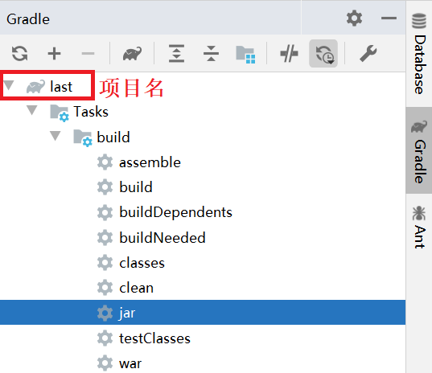

双击，即完成打包。

也可以在终端使用命令:
```bash
gradle jar
```

输出在：


查看 last 项目下的 module 模块，也被打包了：


## 打包单个模块项目

如果只需要打包单独的 module 模块，只需要在右侧 Gradle 中找到 moudle 下的 jar 即可：


也可以在终端使用命令:
```bash
gradle module:jar
```

*自定义打包路径等可以参考：http://www.alloyteam.com/2015/03/shi-yong-gradle-da-bao-zhi-ding-bao-ming-he-lei-di-jar/*

# 发布

如果想使项目对其它团队或组织成员可用，可能我们就需要将项目发布到远程的 maven 仓库。

下面介绍 5 种不同的发布：

1）发布到本地默认 maven 仓库；

2）发布到本地任意位置；

3）发布到远程 maven 仓库，以 Artifactory 为例；

4）发布到公共的二进制仓库 以 Jfrog Bintray 的 Jcenter；

## 发布到本地默认 maven 仓库

在 build.gradle 构建脚本中添加：
```gradle
plugins {
    id 'java'
    id 'war'
    id 'maven-publish' // 引入发布需要的插件
}
```
这个插件提供了一个 publishing 方法，我们就来传一个闭包参数：

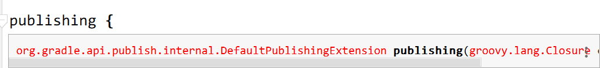

```Gradle
publishing {
    // 发布到本地默认maven仓库
    publications {
        myPublish(MavenPublication) { // 定义 Maven-publications 类型的发布包名字
            //指定group/artifact/version信息，可以不填。
            // 默认使用项目group/name/version作为groupId/artifactId/version
            //groupId project.group
            //artifactId project.name
            //version project.version
            from components.java   // 添加 jar 组件到发布包列表中
            //  如果是war包则是from components.web
        }
    } // publishMyPublishPublicationToMavenLocal 即发布到本地默认的maven仓库
}
```

点击 ‘大象’ 图标刷新，发现 Tasks 下多了个 publishing 。


展开，找到里面的：


双击。


看到这个，恭喜你，成功了！

我们到本地默认 maven 仓库去看一看，我的是 ‘C:\Users\Administrator\.m2\repository’ ,根据项目的坐标寻找：


## 发布到本地任意位置
同样是给 publishing 方法一个闭包参数：

```Gradle
publishing {
    // publications 部分和发布到本地 maven 仓库一样
    publications {
        myPublish(MavenPublication) { // 定义 Maven-publications 类型的发布包名字
            //指定group/artifact/version信息，可以不填。
            // 默认使用项目group/name/version作为groupId/artifactId/version
            //groupId project.group
            //artifactId project.name
            //version project.version
            from components.java   // 添加 jar 组件到发布包列表中
            //  如果是war包则是from components.web
        }
    } // publishMyPublishPublicationToMavenLocal 即发布到本地默认的maven仓库

    // 只是加了个 repositories 方法
    repositories {
        maven{
            name 'myLocal'    // 自定义仓库名
            url "E://"        // 自定义路径
        }
    } // 发布到本地自定义位置 publishMyPublishPublicationToMyLocalRepository
}
```
刷新，任务里面多了个：


双击。


## 发布到远程 maven 仓库

*以 Artifactory提供的远程 maven 仓库为例。*


基于 Java 环境（先配置好 Java 环境）。

下载 Artifactory
https://sourceforge.net/projects/artifactory/

双击运行bin目录下的artifactory.bat文件，在浏览器地址栏输入：http://localhost:8081/artifactory/ ，进入后台管理面板。

如果上述操作后无法访问后台管理面板，还可配置 Artifactory 在 tomcat 上运行，参考教程：https://wenku.baidu.com/view/5ad2a533ee06eff9aef8071d.html

**假设你已经完成了 Artifactory 的安装配置！**

进入后台管理界面：

1）http://localhost:8081/artifactory/

2）如果你是在 tomcat 上运行：启动 tomcat，访问 http://localhost:8080/artifactory/webapp/home.html?16

使用默认的账号密码：admin/password 登录。

**我们这里以在 tomcat 上运行 Artifactory 为例。**

同样是给 publishing 方法一个闭包参数：

publications 部分和发布到本地 maven 仓库一样，只是加了个 repositories 方法
```gradle
publishing {
    // publications 部分和发布到本地 maven 仓库一样
    publications {
        myPublish(MavenPublication) { // 定义 Maven-publications 类型的发布包名字
            //指定group/artifact/version信息，可以不填。
            // 默认使用项目group/name/version作为groupId/artifactId/version
            //groupId project.group
            //artifactId project.name
            //version project.version
            from components.java   // 添加 jar 组件到发布包列表中
            //  如果是war包则是from components.web
        }
    } // publishMyPublishPublicationToMavenLocal 即发布到本地默认的maven仓库

    // 只是加了个 repositories 方法
    repositories {
        maven{
            name 'remoteArtifactory'
            url 'http://127.0.0.1:8080/artifactory/libs-snapshot-local' // 发布的仓库位置
            credentials { // 上传使用的凭证
                username = 'admin'     // artifactory_user
                password = 'password'  // artifactory_password
            }
        }
    } // publishMyPublishPublicationToRemoteArtifactoryRepository
}
```
刷新，运行一下任务：publishMyPublishPublicationToRemoteArtifactoryRepository。

可以看到，上传成功，可供其他团队或组织中的相关人员下载。

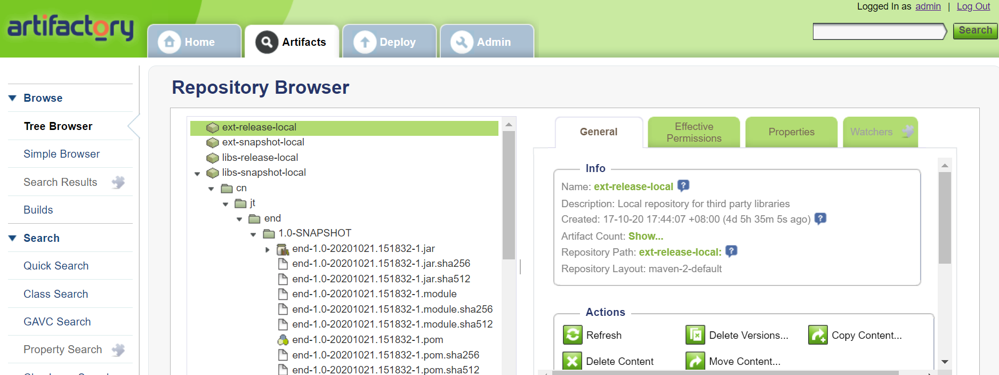

## 发布到公共的二进制仓库

  *公共的二进制仓库有 Jfrog Bintray 的 Jcenter 和 Maven Central，这里以 Jcenter 为例。*

需要先到 https://bintray.com/ 注册账号，创建名为 maven的仓库，创建一个gradle包。

参考教程：https://blog.csdn.net/roly_yu/article/details/53486731

**假设你已经注册号账号并创建了一个名为 maven 仓库和名为 gradle 的包！**

在构建脚本的最上方加上：
```gradle
buildscript {
    dependencies {
        // 引入发布到 Jcenter 需要的依赖
        classpath 'com.novoda:bintray-release:0.9'
    }
}
```
apply 一下
```gradle
apply plugin: 'com.novoda.bintray-release'
```
**还是为我们的 publishing 方法传一个闭包参数：**

```gradle
publishing {

    publications {
        myPublish(MavenPublication){
            from components.java
        }
    }

    repositories {
        maven {
            name 'Bintray'
            url  'https://api.bintray.com/maven/auggie/maven/gradle'
            // https://api.bintray.com/maven/用户名/默认的maven仓库/包名
            credentials { // 上传用的凭证
              username = 'auggie'    // bintray_user 用户名
                password = '60b371a22224505b23d9cf0b8eb9798d706bc703' // API Key 可在个人信息中查看
            }
        }
    }
}
```

还需要加一个 publish 方法说明项目的信息：
```gradle
publish {
    userOrg = 'auggie' // 用户名
    repoName = 'maven' // 上传到 maven 仓库
    groupId = 'cn.jt' // 组名
    artifactId = 'last' // 上传到仓库的项目名，可自定义
    publishVersion = '1.0.0' // 版本号，自定义，不能多次上传同一版本
    uploadName = 'gradle' // 上传到 gradle 包
    desc = 'Oh hi, this is a nice description for nicelogger, right?' // 描述
//    website = 'https://github.com/auggie-12/nice-logger' // github 地址
}
```

刷新，执行任务：publishMyPublishPublicationToBintrayRepository。

如果报 Could not PUT "..." 错误，可能是权限不足。

可以尝试，IDEA 的终端输入：
gradle clean build bintrayUpload -PbintrayUser=你的用户名 -PbintrayKey=你的APIKEY -PdryRun=false

我们登录刚才在 https://bintray.com/ 注册的账号，在 gradle 包中的 files 中看到上传成功：

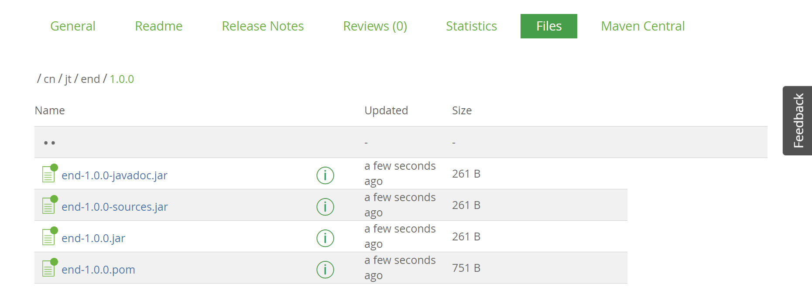

**我们也可以把我们发布的包添加到 JCenter中，但这需要通过审核！**


**假设我们审核通过了**，我们在左下角找到添加依赖的 Gradle 代码，复制：

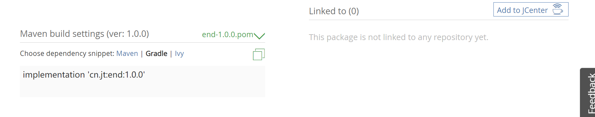

改用 JCenter 仓库
```gradle
repositories {
    // mavenCentral()
    jcenter()
```
可以在项目中添加我们发布到 JCenter 的项目了：
```gradle
repositories {
    implementation 'cn.jt:end:1.0.0'
}
```

# 部署
以部署到 tomcat 服务器上为例。教程参考：https://www.cnblogs.com/shwo/p/9962441.html

build.gradle:
```gradle
// 使用tomcat插件部署

apply plugin: 'idea'
apply plugin: 'war' // 引入war插件, 它默认包含java插件
apply plugin: 'com.bmuschko.tomcat' //tomcat: 插件

group 'cn.jt'
version '1.0-SNAPSHOT'

sourceCompatibility = 1.8

// tomcat: 以下配置会在第一次启动时下载插件二进制文件
buildscript {
    repositories {
        jcenter()
    }
    dependencies {
        classpath 'com.bmuschko:gradle-tomcat-plugin:2.5'
    }
}

repositories {
    mavenCentral()
}

dependencies {
    def tomcatVersion = '8.5.16'
    tomcat "org.apache.tomcat.embed:tomcat-embed-core:${tomcatVersion}",
            "org.apache.tomcat.embed:tomcat-embed-logging-juli:8.5.2",
            "org.apache.tomcat.embed:tomcat-embed-jasper:${tomcatVersion}"
}
// tomcat: 一些协议设置
tomcat {
    httpProtocol = 'org.apache.coyote.http11.Http11Nio2Protocol'
    ajpProtocol  = 'org.apache.coyote.ajp.AjpNio2Protocol'
}
```
双击右侧 Gradle -> Tasks -> web application -> tomcatRun:


访问：


