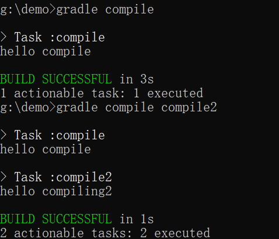
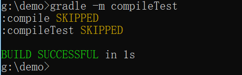
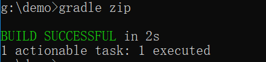
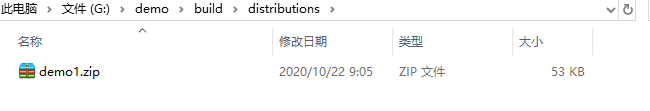

# 命令行下gradle的使用
## project的创建
**mkdir filename**创建项目所在文件夹

**gradle init**创建项目


其中project type有四种类型分别是：

1、基础类型
2、应用类型
3、库类型
4、gradle插件

build script DSL（构建脚本语言）：

1、groovy
2、kotlin

## 创建的project里各文件的作用


**gradle** 包含gradle wapper的可执行库以及一些配置属性

**gradlew、gradlew.bat**分别是基于UNIX与WINDOWS的gradle wapper脚本

**build.gradle**项目配置脚本，用于配置当前项目中的任务

**setting.gradle**用于配置哪些项目参与构建的配置脚本

## task的创建以及基本操作
### task的创建（在build.gradle里创建）
task taskname(type, group, description,depensOn) {}

**type**:表示任务的种类，比如copy、zip等（必要）

**group**：表示任务所属的组（非必要）

**description**：表示对任务的描述（非必要）

**depensOn**：表示任务之间的依赖关系（非必要）
```java
task compile {
    doLast {
        println 'hello compile'
    }
}


task compile2 {
    doLast {
        println 'hello compiling2'
    }
}

task compileTest(dependsOn:compile) {
    doLast {
        println 'hello compileTest'
    }
}
```
**dependsOn:compile** 表示compileTest依赖于compile即在运行compileTest时会先执行compile在执行compileTest

### task的运行以及查看
**gradle taskname1 taskname2** 按照先后运行名为taskname1、taskname2的任务



有依赖关系时：


**gradle tasks --all** 查看所有任务


**gradle help --task taskname**查看taskname的详细信息


其中的type、description、group都是创建任务时就已经确定，path是关于build.gradle文件内的任务名

**gradle taskname1 -x taskname2** 运行taskname1但不运行taskname1里的taskname2任务，主要用来避免依赖关系的运行


**-m标签** 使用此标签可以查看任务的执行顺序，并不会真的执行（适合多依赖关系）



**-q标签** 简化输出内容，用来屏蔽其他辅助型的输出，只输出task的输出以及错误流


## 插件的使用
插件的使用需要在build.gradle文件里导入插件

```java
plugins{
    id "插件名"//比如 java,web,base等等
}
```

比如我需要对某个文件进行打包那么代码如下：

```java
plugins {
    id "base"
}

task zip(type: Zip) {
	from "gradle"
	archiveFileName = "demo1.zip"
}
```



这里表示使用插件base将文件名为gradle的文件打包到名为demo1.zip的文件里。这些打包好的文件会统一放在项目里的新建build/distributions文件夹里（运行任务后自动创建）



**注意这里需要表明task的类型type，若未注明则在任务执行时会报错**

```java
plugins {
    id "base"
}

task zip {
	from "gradle"
	archiveFileName = "demo1.zip"
}
```


## 项目属性的查看
**gradle properties** 查看项目的所有属性


如果需要标注版本号，只需在build.gradle里插入：
```java
version 1.0//版本号
```
之后再次查看项目属性时便可以看到版本信息

## 项目日志查看
**gradle --profile**

运行后在build/reports/profile(自动生成)会生成一个html文件打开便可以查看项目日志


## 项目分享

**gradle build --scan** 使用后会生成链接


**输入yes获取链接**


浏览器打开链接输入邮箱激活后便可进行分享


