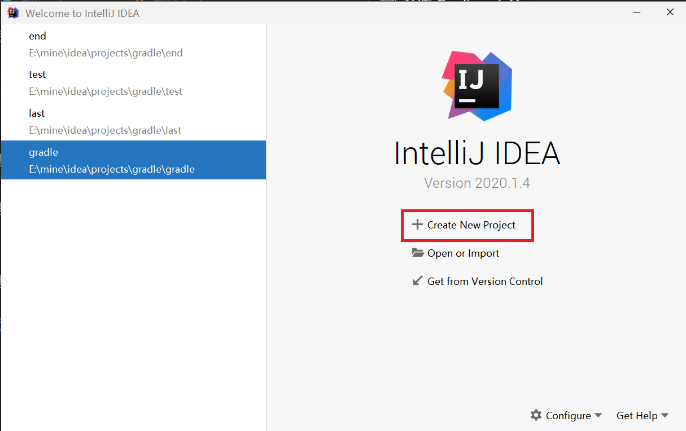
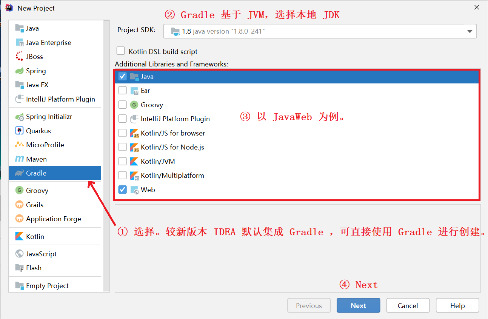
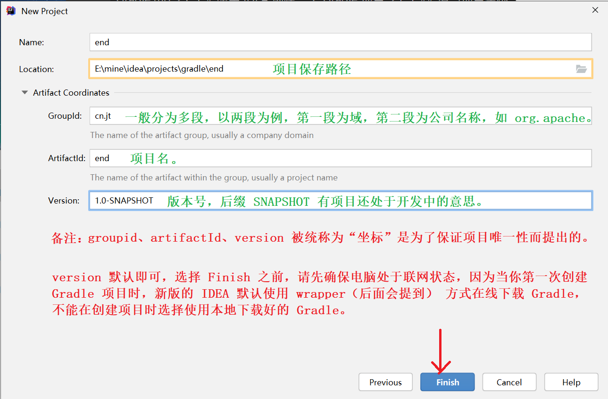
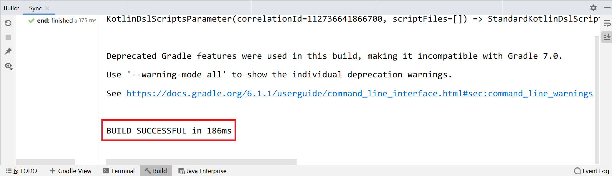
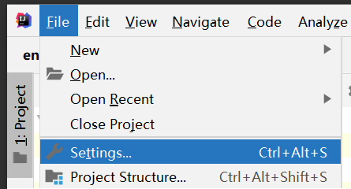
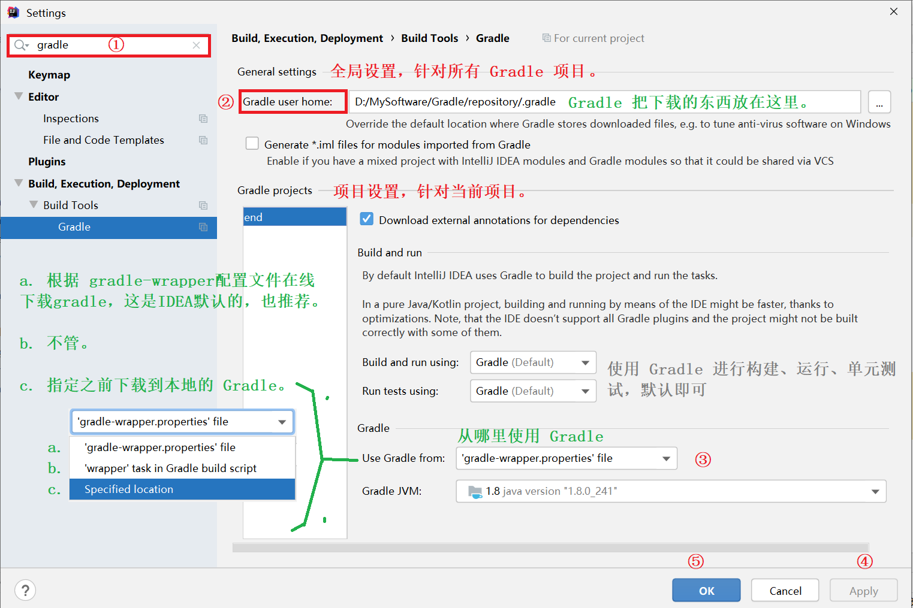
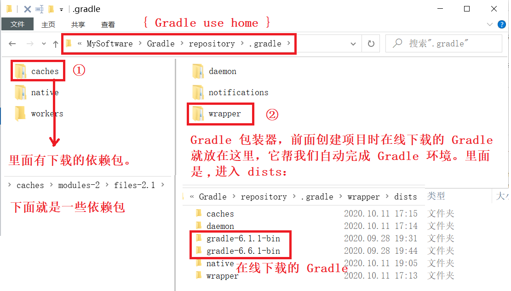
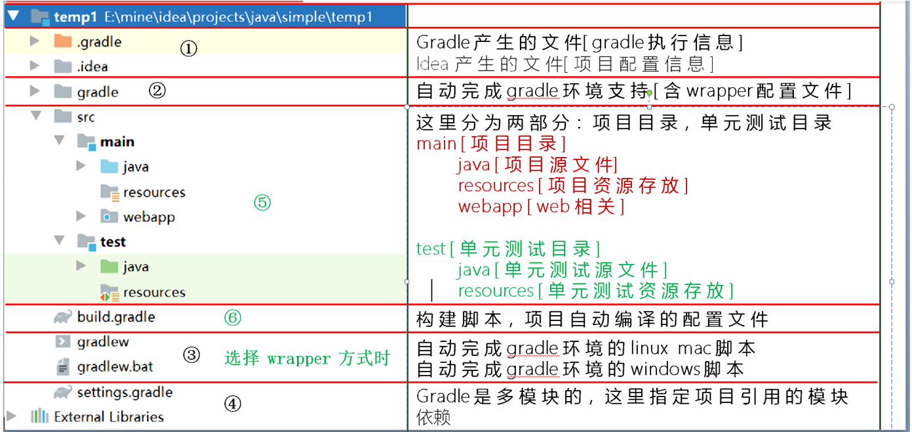
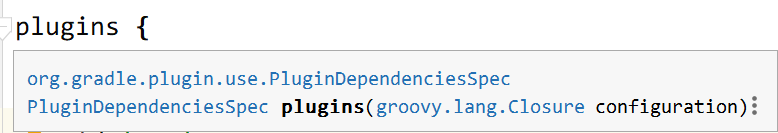
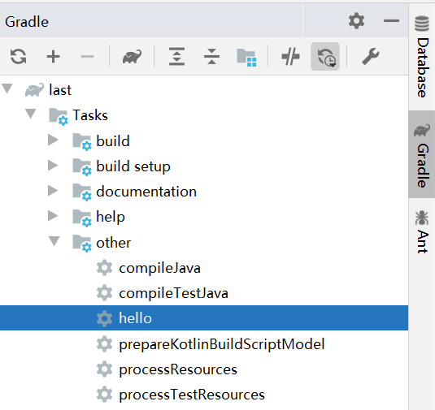

# 使用 IDEA 创建一个基于 Gradle 的项目
## 打开 IDEA

## 选择 Create New Project

## 选择项目类型

## 填写项目坐标

## 等待，出现 BUILD SUCCESSFUL... 说明创建成功


# 查看项目配置
**进入 File -> Setting，或快捷键 Ctrl + Alt + S 。**



**左上角搜索框键入 ‘gradle’，你会看到项目的配置信息，大致是这样的**



## Gradle use home
*-- Gradle 把下载的东西（依赖、插件、Gradle 包装器等）放在这里！ --*

**如果**设置了 ‘GRADLE_USER_HOME’ 环境变量，IDEA 会根据环境变量进行推导，并推荐一个路径作为默认路径。

**如果** IDEA 没有推导出，
会以 ‘C:\Users\Administrator\.gradle’ 作为默认值
*(Windows)*。

*-- 可以手动指定任意路径。手动指定优于环境变量。 --*

**看一下 Gradle use home:**



## Use gradle from
**a** . specified location ：使用之前下载到本地的 gradle 进行项目构建。

**b**. wrapper task in build.gradle : 通过执行构建脚本中自定义的 wrapper 任务下载gradle。

**c** . gradle-wrapper.properties : 使用配置文件提供的 url 下载gradle包装器。

**推荐 c ，可以将Gradle版本的更新委派给Gradle并自动下载该版本的Gradle 。**

# 查看项目目录结构


③
gradlew，gradlew.bat会：
解析wrapper文件，拿到gradle下载地址，首先判断本地是否存在该版本gradle，有则直接
利用 ./gradle 目录下对应的版本的 gradle 进行相应自动编译操作。
没有，根据地址下载到本地，在根据./gradle目录下对应版本的gradle进行相应的自动编译操作。

⑤ Java 插件引入了源集（Source sets）的概念，源集可以简单理解为“一组源文件的集合”，在逻辑上对源文件进行分组。
java插件提供了两个标准源集：main 和 test。这是 java 插件引入的两个约定，就不需要手动创建源文件目录和资源文件目录了。

⑥ build.gradle 构建脚本
Gradle 的自动化构建项目就是通过执行 build.gradle 构建脚本实现的。
而构建脚本中引入了项目需要用到的 gradle 插件。
Gradle可以认为是一个框架，负责定义流程和规则。而大多数的功能都是通过插件的方式来完成的。

# 认识 Gradle 构建脚本
group、version、plugin、repositories、dependencies 都是 Gradle 预定义好的方法，Gradle 在构建项目时会自动执行这些方法，我们只需要向里面传入参数，而大多数参数都是闭包。
## group 、version
```Groovy
group 'cn.jt' // 等价于：setGroup('cn.jt')
version '1.0-SNAPSHOT' // 等价于：setVersion('1.0-SNAPSHOT')
```

## plugin
```groovy
plugins {
    id 'java'
    id 'war'
//  id '插件名' <-- 引入插件
}
```
插件。plugin 方法的参数就是一个闭包：



我们也可以在 build.gradle 中自定义插件,刷新：
```Groovy
// 自定义插件
class MyPlugin implements Plugin<Project> {
    @Override
    void apply(Project project) {
        //新建task hello
        project.task('hello') {
            doLast {
                println 'Hello MyPlugin!'
            }
        }
    }
}
// 引入插件，观察 other 中任务变化
apply plugin: MyPlugin
```
右侧 other 中多了一个我们刚才自定义的 ‘hello’ 任务：



我们双击运行：


***当然你也可以自定义功能更加复杂的插件。***

## repositories
```groovy
repositories {
    mavenCentral()
}
```
仓库。这里调用了 mavenCentral() 的方法表示先从本地的 gradle 仓库中寻找依赖包，找到了直接导入，没找到再到 maven 中央仓库寻找。
也可以设置从阿里云下载。
```groovy
repositories {
 	// mavenCentral()
    maven {
        url 'http://maven.aliyun.com/nexus/content/groups/public/'
    }
}
```
这和上面是一样的，只是换了一个 url 。

## dependencies
依赖。
