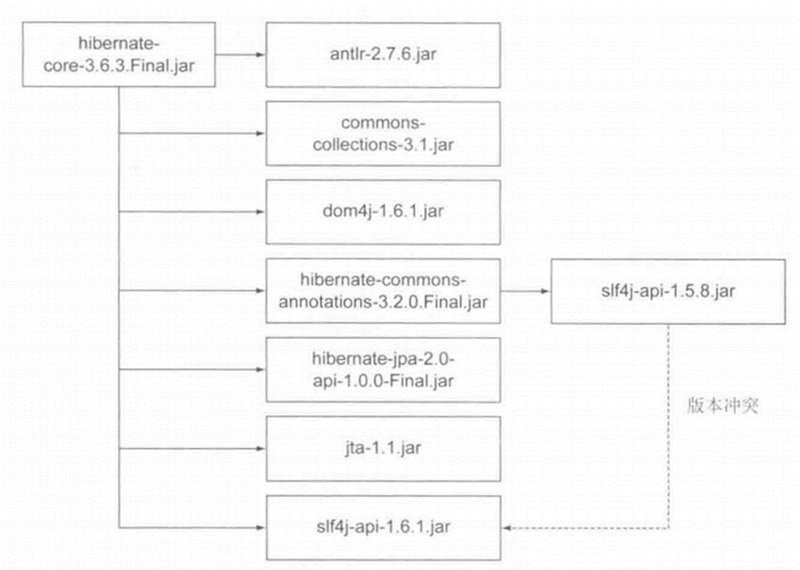
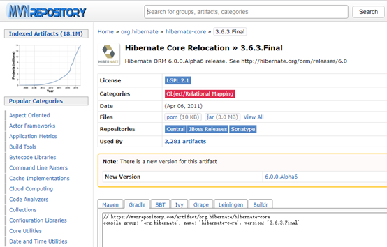
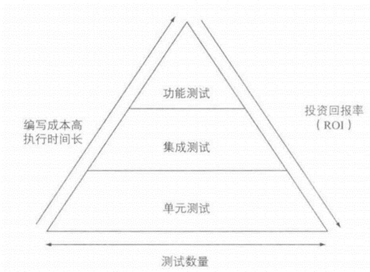
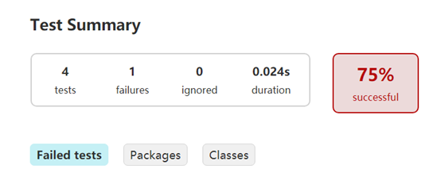

# 依赖管理
## 依赖概述

​几乎所有的基于JVM的软件项目都需要依赖外部类库来重用现有的功能。自动化的依赖管理可以明确依赖的版本，可以解决因传递性依赖带来的版本冲突。

​依赖可以是一个 project(或者说一个module)、一个 jar 包，或者是依赖远程仓库。例：

```gradle
dependencies {

  //方式1： 依赖一个名字为 "common" 的 project
  compile project(":common")

  //方式2： 依赖一个本地 jar
  //依赖当前 module/libs/aliyun-vod-croe-android-sdk-1.0.0.jar
  compile files('libs/aliyun-vod-croe-android-sdk-1.0.0.jar')

  //方式2 扩展：通过 fileTree 指定 dir 依赖所有的 jar 包
  compile fileTree(dir: 'libs', include: ['*.jar'])

  //方式3： 依赖一个远程仓库的包
  compile 'com.android.support:appcompat-v7:26.1.0'
}
```

## 自动化的依赖管理

自动化依赖管理需要知道依赖的确切版本和管理传递性依赖（即解决版本冲突）。

在项目中，如果不清楚项目依赖的版本，那么项目的维护会变得很困难，因为如果没有去精心记录，根本无法确定项目所依赖的类库版本实际支持哪些特性。

传递性依赖在项目开发的早期阶段就需要注意。这些依赖类库是项目正常工作的保障，一个类库可能需要许多其他类库才能正常工作，这就会存在传递性依赖，（比如B依赖A，如果C依赖B，那么C依赖A）。




## 添加依赖

​一个依赖是通过group标识符、name和一个指定版本version来确定的，是可以唯一标识一个依赖，根据group、name、version可以在仓库中找到唯一的一个jar包。

我们可以到maven仓库 https://mvnrepository.com/ 去找我们要依赖的包，可以选择要依赖的版本以及该包在不同构建工具下的写法，复制到build.gradle中，可以看到引入依赖之后可以联想出一些里面的类。



## 版本冲突

这里我们引入的hibernate依赖是存在传递性依赖和版本冲突的，我们在旁边Gradle里项目->task->build->build，发现Gradle并没有报错，因为如果 Gradle 发现有版本冲突，Gradle会 默认选择当前该库的最新版本。

我们通过在Gradle的task->help->dependencies，可以比较清楚的看到版本间的关系。理解 Gradle 依赖关系树的格式：

•	+- - - 是依赖分支库的开始。

•	| 标识还是在之前的依赖库中的依赖，显示它依赖的库。

•	\- - - 是依赖库的末尾。

除了通过dependencies查看，我们还可以配置build.gradle，当 Gradle 构建遇到依赖冲突时，就立即构建失败,来提醒我们产生了版本冲突。

```gradle
configurations.all() {
    Configuration configuration ->
        //当遇到版本冲突时直接构建失败
        configuration.resolutionStrategy.failOnVersionConflict()
}
```

我们在旁边Gradle里项目->task->build->build，Gradle报错，解决版本冲突的方法有两种：

1）排除传递性依赖：排除一个依赖或是排除所有的传递性依赖（后者是少见的，我们不可能排除所有的传递性依赖）。使用ModuleDependency中的exclude方法来排除传递性依赖，注意排除属性与常用的依赖标记略有不同，这里的module相当于name，因为Gradle不允许只排除某个特定版本的依赖，所以version属性是不可用的。

```gradle
//    compile (group: 'org.hibernate', name: 'hibernate-core', version: '3.6.3.Final'){
//        exclude group:'org.slf4j',module:'slf4j-api'//对某一个库排除传递依赖
//        //transitive = false  //排除所有的传递性依赖
//    }
```

2）为发生冲突的依赖强制指定一个版本

```java
configurations.all() {

  Configuration configuration ->

    configuration.resolutionStrategy.force(['org.slf4j:slf4j-api:1.6.1'])

   //或者这样写

   //resolutionStrategy.setForcedModules(['org.slf4j:slf4j-api:1.6.1'])

}
```

到目前为止，我们只声明了对外部类库的某一个特定版本的依赖，我们还可以获取最新版本的依赖，也就是动态版本声明，它有一个特定的语法，如果你想使用最新版本的依赖，必须使用占位符latest.integration，例如'org.slf4j:slf4j-api:latest.integration'，这里用冒号：分隔的写法就相当于是 group:name:version，而version用占位符表示了。

但动态版本最好是少用或者不用，因为在项目中，可靠的可重复构建的才是最重要的，使用最新版本的类库可能会导致构建失败，更坏的情况可能是在不知情的情况下，引入了不兼容的类库版本和副作用，因此，我们应该习惯去声明类库的确切版本。

# 单元测试

测试代码在软件开发生命周期中是一件重要的事情。通过检查软件是否按预期运行来确保软件的质量。Gradle集成了许多Java和 Groovy 的单元测试框架。可以使用Junit、TestNG和Spock编写测试，Gradle允许在一个项目中使用不同的测试框架。如果要构建可靠的、高质量的软件，自动化测试是开发工具箱的关键组成部分。此外，它将有助于减少手工测试的成本，提高开发团队重构现有代码的能力，并帮助在开发生命周期中尽早地发现代码中的缺陷。

## 自动化测试

并不是所有的自动化测试都一样。它们通常在使用范围、实现难度和执行时间上存在不同。

自动化测试类型：单元测试、集成测试、功能测试。

我们可能会想哪种测试类型最适合项目以及如何扩展的问题。在最理想的情况下，我们可以混合使用这些测试来确保代码能够在不同的架构上正常工作。但是，所编写的测试数量是需要花费时间和精力来实现和维护的。所编写的测试越简单，执行就越快，就会得到更高的投资回报率（ROI）。

自动化测试金字塔------这是Mike Cohn在他的书Succeeding with Agile:Software Development Using Scrum(Addsion Wesley ,2009)中提出来的。

​


所以为了优化投资回报率，代码库应该包含大量的单元测试、少量集成测试以及更少的功能测试。

### 功能测试

​功能测试通常用于测试应用程序的端到端功能，包括从用户的角度与所有外部系统的交互。功能测试是最难实现的和运行最慢的，因为它们需要模拟用户交互。以Web应用程序为例，功能测试的工具需要能够点击链接，将数据输入表单字段中，或者在浏览器窗口中提交表单。因为用户界面会随着时间的推移发生改变，维护功能测试代码就会变得乏味而耗时。

### 集成测试

​集成测试用来测试一个完整的组件或子系统。确保多个类之间的交互是否按预期运行。集成测试的一个典型场景就是验证产品代码和数据库之间的交互。验证的结果是，依赖的子系统、资源以及服务在测试执行中都是可以访问的。集成测试通常比单元测试需要更长的执行时间，而且更加难以维护，失败的原因可能更难以诊断。

### 单元测试

​单元测试与产品代码实现一起作为一个task来执行，目的是测试代码的最小单元。在基于Java的项目中，这个单元是一个方法。在单元测试中，需要避免与其他类或外部系统交互（例如，数据库或文件系统)。在被测试代码中对其他组件的引用，通常用测试替身独立出来，这是测试中替代组件的一个通用术语，如Stub（打桩）或Mock（模拟)。单元测试很容易编写，可以快速执行，并在开发过程中针对代码的正确性提供宝贵的反馈。

​idea可以为我们选择的方法自动生成xxxTest.java文件，Junit提供了一些辅助函数用来帮助我们来判断被测试的方法是否如我们预期的效果一样正常执行。断言就是专门用来验证输出和期望是否一致的一个工具，它是通过比较一个实际值actual和一个期望值expected来实现的。当我们对类，模块或者方法的输入和输出有着很明确的定义和认识，当程序的输出结果和输入不匹配时，我们想让程序有一个明确的返回。比如：我明确地知道1+1=2,我现在就想知道我输入1+1会不会得到2，如果不是程序返回一个错误。

```java
`assertEquals(expected:3,actual:4,delta:1);//delta 这个参数为误差参数，表示如果 expected 和 actual 之间的差值在 delta 范围之内则认为该断言的结果是正确的
```

​我们在旁边Gradle里项目->task->verification->test，我们可以查看Gradle生成的HTML报告（build/reports/test），报告总结了运行测试的数量，失败率和执行时间，可以通过点击切换包和类的视图，如果有一个测试失败，可以查看失败断言的整个跟踪栈信息。



一般，单元测试失败后项目构建也会随之而失败，但是有时候我们不想让一个地方的测试失败而影响后面的构建，那我们可以在build.gradle中添加配置去忽略单元测试的失败结果。

```gradle
 test
 {
       ignoreFailures = true//忽略单元测试的失败结果
 }
```
