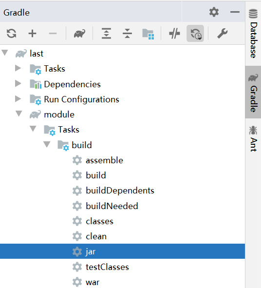
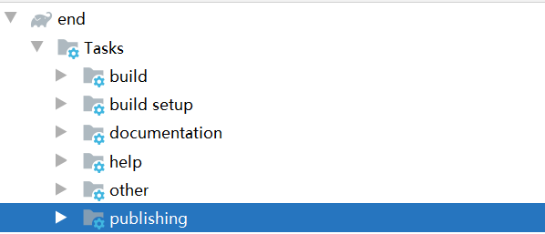
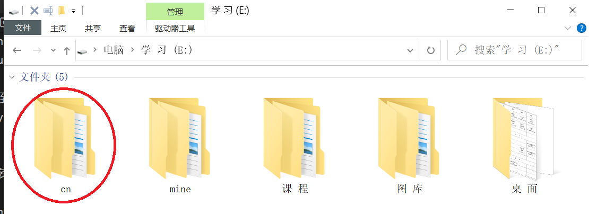
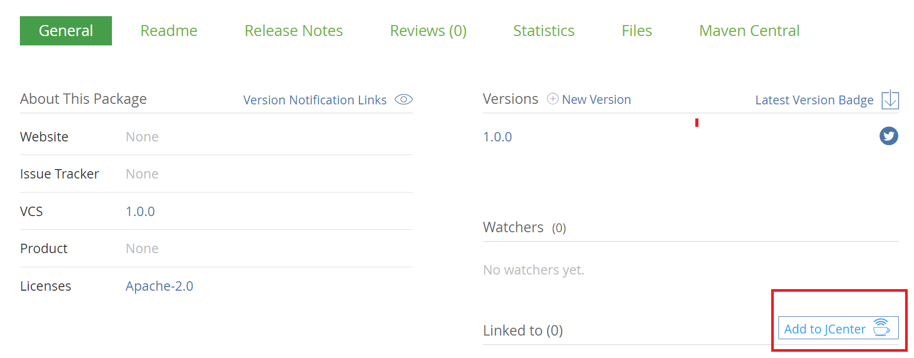

# 打包

***如果我们项目的某些模块的功能是公用的，我们就需要对项目进行打包。***

为什么要打包 jar 包，可以参考：https://www.zhihu.com/search?type=content&q=jar%E5%8C%85%E9%82%A3%E4%BA%9B%E4%BA%8B

下面介绍最最基本的打包方法。

## 打包整个项目及其中的模块
如果需要将整个项目和项目中的所有模块单独打包，右侧 Gradle 中找到项目名下的 jar 或 war，如下图所示：


双击，即完成打包。

也可以在终端使用命令:
```bash
gradle jar
```

输出在：


查看 last 项目下的 module 模块，也被打包了：


## 打包单个模块项目

如果只需要打包单独的 module 模块，只需要在右侧 Gradle 中找到 moudle 下的 jar 即可：



也可以在终端使用命令:
```bash
gradle module:jar
```

*自定义打包路径等可以参考：http://www.alloyteam.com/2015/03/shi-yong-gradle-da-bao-zhi-ding-bao-ming-he-lei-di-jar/*

# 发布

如果想使项目对其它团队或组织成员可用，可能我们就需要将项目发布到远程的 maven 仓库。

下面介绍 5 种不同的发布：

1）发布到本地默认 maven 仓库；

2）发布到本地任意位置；

3）发布到远程 maven 仓库，以 Artifactory 为例；

4）发布到公共的二进制仓库 以 Jfrog Bintray 的 Jcenter；

## 发布到本地默认 maven 仓库

在 build.gradle 构建脚本中添加：
```gradle
plugins {
    id 'java'
    id 'war'
    id 'maven-publish' // 引入发布需要的插件
}
```
这个插件提供了一个 publishing 方法，我们就来传一个闭包参数：


```Gradle
publishing {
    // 发布到本地默认maven仓库
    publications {
        myPublish(MavenPublication) { // 定义 Maven-publications 类型的发布包名字
            //指定group/artifact/version信息，可以不填。
            // 默认使用项目group/name/version作为groupId/artifactId/version
            //groupId project.group
            //artifactId project.name
            //version project.version
            from components.java   // 添加 jar 组件到发布包列表中
            //  如果是war包则是from components.web
        }
    } // publishMyPublishPublicationToMavenLocal 即发布到本地默认的maven仓库
}
```

点击 ‘大象’ 图标刷新，发现 Tasks 下多了个 publishing 。



展开，找到里面的：


双击。


看到这个，恭喜你，成功了！

我们到本地默认 maven 仓库去看一看，我的是 ‘C:\Users\Administrator\.m2\repository’ ,根据项目的坐标寻找：


## 发布到本地任意位置
同样是给 publishing 方法一个闭包参数：

```Gradle
publishing {
    // publications 部分和发布到本地 maven 仓库一样
    publications {
        myPublish(MavenPublication) { // 定义 Maven-publications 类型的发布包名字
            //指定group/artifact/version信息，可以不填。
            // 默认使用项目group/name/version作为groupId/artifactId/version
            //groupId project.group
            //artifactId project.name
            //version project.version
            from components.java   // 添加 jar 组件到发布包列表中
            //  如果是war包则是from components.web
        }
    } // publishMyPublishPublicationToMavenLocal 即发布到本地默认的maven仓库

    // 只是加了个 repositories 方法
    repositories {
        maven{
            name 'myLocal'    // 自定义仓库名
            url "E://"        // 自定义路径
        }
    } // 发布到本地自定义位置 publishMyPublishPublicationToMyLocalRepository
}
```
刷新，任务里面多了个：


双击。



## 发布到远程 maven 仓库

*以 Artifactory提供的远程 maven 仓库为例。*


基于 Java 环境（先配置好 Java 环境）。

下载 Artifactory
https://sourceforge.net/projects/artifactory/

双击运行bin目录下的artifactory.bat文件，在浏览器地址栏输入：http://localhost:8081/artifactory/ ，进入后台管理面板。

如果上述操作后无法访问后台管理面板，还可配置 Artifactory 在 tomcat 上运行，参考教程：https://wenku.baidu.com/view/5ad2a533ee06eff9aef8071d.html

**假设你已经完成了 Artifactory 的安装配置！**

进入后台管理界面：

1）http://localhost:8081/artifactory/

2）如果你是在 tomcat 上运行：启动 tomcat，访问 http://localhost:8080/artifactory/webapp/home.html?16

使用默认的账号密码：admin/password 登录。

**我们这里以在 tomcat 上运行 Artifactory 为例。**

同样是给 publishing 方法一个闭包参数：

publications 部分和发布到本地 maven 仓库一样，只是加了个 repositories 方法
```gradle
publishing {
    // publications 部分和发布到本地 maven 仓库一样
    publications {
        myPublish(MavenPublication) { // 定义 Maven-publications 类型的发布包名字
            //指定group/artifact/version信息，可以不填。
            // 默认使用项目group/name/version作为groupId/artifactId/version
            //groupId project.group
            //artifactId project.name
            //version project.version
            from components.java   // 添加 jar 组件到发布包列表中
            //  如果是war包则是from components.web
        }
    } // publishMyPublishPublicationToMavenLocal 即发布到本地默认的maven仓库

    // 只是加了个 repositories 方法
    repositories {
        maven{
            name 'remoteArtifactory'
            url 'http://127.0.0.1:8080/artifactory/libs-snapshot-local' // 发布的仓库位置
            credentials { // 上传使用的凭证
                username = 'admin'     // artifactory_user
                password = 'password'  // artifactory_password
            }
        }
    } // publishMyPublishPublicationToRemoteArtifactoryRepository
}
```
刷新，运行一下任务：publishMyPublishPublicationToRemoteArtifactoryRepository。

可以看到，上传成功，可供其他团队或组织中的相关人员下载。


## 发布到公共的二进制仓库

  *公共的二进制仓库有 Jfrog Bintray 的 Jcenter 和 Maven Central，这里以 Jcenter 为例。*

需要先到 https://bintray.com/ 注册账号，创建名为 maven的仓库，创建一个gradle包。

参考教程：https://blog.csdn.net/roly_yu/article/details/53486731

**假设你已经注册号账号并创建了一个名为 maven 仓库和名为 gradle 的包！**

在构建脚本的最上方加上：
```gradle
buildscript {
    dependencies {
        // 引入发布到 Jcenter 需要的依赖
        classpath 'com.novoda:bintray-release:0.9'
    }
}
```
apply 一下
```gradle
apply plugin: 'com.novoda.bintray-release'
```
**还是为我们的 publishing 方法传一个闭包参数：**

```gradle
publishing {

    publications {
        myPublish(MavenPublication){
            from components.java
        }
    }

    repositories {
        maven {
            name 'Bintray'
            url  'https://api.bintray.com/maven/auggie/maven/gradle'
            // https://api.bintray.com/maven/用户名/默认的maven仓库/包名
            credentials { // 上传用的凭证
              username = 'auggie'    // bintray_user 用户名
                password = '60b371a22224505b23d9cf0b8eb9798d706bc703' // API Key 可在个人信息中查看
            }
        }
    }
}
```

还需要加一个 publish 方法说明项目的信息：
```gradle
publish {
    userOrg = 'auggie' // 用户名
    repoName = 'maven' // 上传到 maven 仓库
    groupId = 'cn.jt' // 组名
    artifactId = 'last' // 上传到仓库的项目名，可自定义
    publishVersion = '1.0.0' // 版本号，自定义，不能多次上传同一版本
    uploadName = 'gradle' // 上传到 gradle 包
    desc = 'Oh hi, this is a nice description for nicelogger, right?' // 描述
//    website = 'https://github.com/auggie-12/nice-logger' // github 地址
}
```

刷新，执行任务：publishMyPublishPublicationToBintrayRepository。

如果报 Could not PUT "..." 错误，可能是权限不足。

可以尝试，IDEA 的终端输入：
gradle clean build bintrayUpload -PbintrayUser=你的用户名 -PbintrayKey=你的APIKEY -PdryRun=false

我们登录刚才在 https://bintray.com/ 注册的账号，在 gradle 包中的 files 中看到上传成功：


**我们也可以把我们发布的包添加到 JCenter中，但这需要通过审核！**



**假设我们审核通过了**，我们在左下角找到添加依赖的 Gradle 代码，复制：


改用 JCenter 仓库
```gradle
repositories {
    // mavenCentral()
    jcenter()
```
可以在项目中添加我们发布到 JCenter 的项目了：
```gradle
repositories {
    implementation 'cn.jt:end:1.0.0'
}
```

# 部署
以部署到 tomcat 服务器上为例。教程参考：https://www.cnblogs.com/shwo/p/9962441.html

build.gradle:
```gradle
// 使用tomcat插件部署

apply plugin: 'idea'
apply plugin: 'war' // 引入war插件, 它默认包含java插件
apply plugin: 'com.bmuschko.tomcat' //tomcat: 插件

group 'cn.jt'
version '1.0-SNAPSHOT'

sourceCompatibility = 1.8

// tomcat: 以下配置会在第一次启动时下载插件二进制文件
buildscript {
    repositories {
        jcenter()
    }
    dependencies {
        classpath 'com.bmuschko:gradle-tomcat-plugin:2.5'
    }
}

repositories {
    mavenCentral()
}

dependencies {
    def tomcatVersion = '8.5.16'
    tomcat "org.apache.tomcat.embed:tomcat-embed-core:${tomcatVersion}",
            "org.apache.tomcat.embed:tomcat-embed-logging-juli:8.5.2",
            "org.apache.tomcat.embed:tomcat-embed-jasper:${tomcatVersion}"
}
// tomcat: 一些协议设置
tomcat {
    httpProtocol = 'org.apache.coyote.http11.Http11Nio2Protocol'
    ajpProtocol  = 'org.apache.coyote.ajp.AjpNio2Protocol'
}
```
双击右侧 Gradle -> Tasks -> web application -> tomcatRun:


访问：


